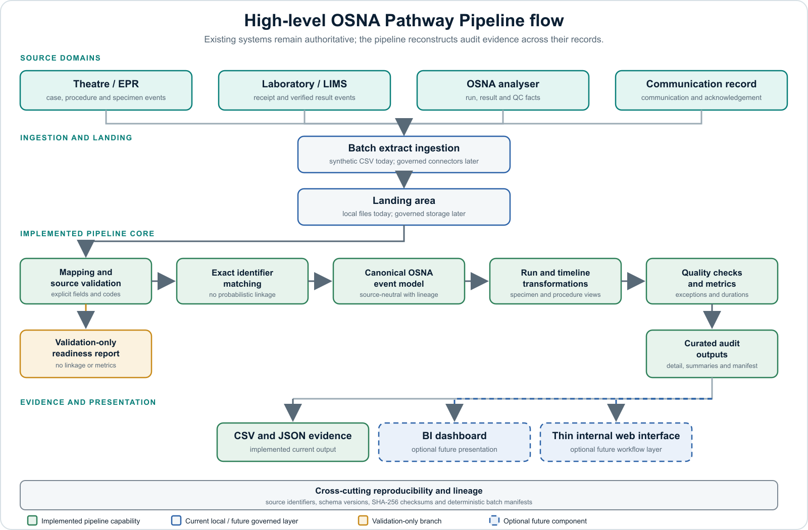

# OSNA Pathway Pipeline

**A synthetic-first data product for reconstructing and measuring the intraoperative OSNA
pathway between breast surgery and the molecular laboratory.**

> **Project status:** Early technical prototype. It is not validated, deployed, or approved for
> clinical use. Full pathway processing is restricted to deliberately generated synthetic data.
> Approved clinical extracts may only use the validation-only path inside a governed environment.

## How the pipeline works

The pipeline core is currently implemented locally with synthetic CSV files. In a future approved
environment, governed source connectors and storage could replace the local file-handling layer
without changing the canonical event model or the main validation and transformation logic.



The current repository implements the mapping, validation, exact-identifier matching, canonical
event model, transformations, metrics, quality controls, CSV and JSON evidence files, and batch
manifest. Governed clinical-system ingestion, shared storage, a BI dashboard, and a web interface
are possible future layers; they are not currently deployed or approved.

## Current development snapshot

Version `0.5.0` implements the first end-to-end synthetic technical proof of the product
hypothesis. The repository now includes:

- four versioned source contracts for theatre, laboratory, analyser, and communication events;
- configurable mapping for event-shaped extracts and an aggregate validation-only readiness
  report;
- exact-identifier matching, a source-neutral canonical event model, and event-level lineage;
- specimen timelines, complete assay-run histories, and procedure-level summaries;
- explicit handling of multi-specimen procedures, repeat runs, failed QC, missing events,
  contradictory sequences, and orphan records;
- six descriptive pathway metrics with missing and invalid data kept visible;
- detailed exceptions, grouped quality summaries, and an optional automation quality gate;
- deterministic batch manifests with versions, counts, SHA-256 checksums, and a content-derived
  batch identifier; and
- 39 automated tests covering mapping, matching, metrics, quality, command-line behaviour,
  readiness, lineage, and end-to-end outputs.

The supplied synthetic demonstration currently processes 36 source records into 41 canonical
events, 5 specimen timelines, 6 assay-run histories, and 4 procedure summaries. Its deliberately
mixed scenarios produce 3 complete, 1 incomplete, and 1 invalid specimen pathway. These are test
results, not clinical performance figures.

| Product area | Current position |
| --- | --- |
| Synthetic end-to-end pathway processing | Implemented and tested |
| Mapped source validation and readiness reporting | Implemented and tested |
| Reproducible audit and release checks | Implemented locally |
| Hospital-specific source mapping | Not yet discovered or approved |
| Retrospective clinical pathway analysis | Not enabled |
| Live clinical integration or user interface | Not designed or approved |

## Technology stack

The current product is a local, file-based batch pipeline rather than a web application or
deployed cloud platform.

| Layer | Current technology and approach |
| --- | --- |
| Product form | Command-line batch data pipeline |
| Language | Python 3.11 or later |
| Runtime dependencies | Python standard library only |
| Package and build | `src`-layout Python package, `pyproject.toml`, and `setuptools` |
| Source data | Four event-shaped CSV extracts representing theatre, laboratory, OSNA analyser, and communication records |
| Configuration | Versioned JSON mappings for filenames, columns, controlled values, and data classification |
| Data contracts | Versioned JSON Schema documents supported by explicit Python validation rules |
| Processing | Modular connectors, validation, exact-identifier matching, canonicalisation, transformations, metrics, quality checks, and lineage components |
| Outputs | CSV analytical and audit tables plus JSON summaries, readiness reports, and batch manifests |
| Testing | Python `unittest`; 39 automated tests covering individual rules and end-to-end behaviour |
| Continuous integration | GitHub Actions configured for Python 3.11, 3.12, and 3.13 with deterministic-output, contract, build, and installed-package checks |
| Current deployment | Local and synthetic-only; no clinical-system connection |
| Future infrastructure | Azure storage, orchestration, access control, and monitoring are deferred until discovery, governance, and product value are established |

The current stack does not include a database, data warehouse, API, frontend, dbt project,
dashboard, machine-learning model, or deployed Azure service. These components should be added
only when a validated product requirement justifies them. See the
[architecture documentation](docs/architecture/README.md) and
[architecture decisions](docs/architecture/decisions/) for the design rationale.

## What this project does

One-Step Nucleic Acid Amplification (OSNA) is an intraoperative molecular method used to assess
sentinel lymph nodes in breast cancer surgery. The test is performed in the laboratory, but the
surrounding process crosses theatre, specimen transport, the analyser, laboratory systems,
telephone communication, and the electronic patient record.

This project turns those separate records into traceable specimen timelines, assay-run histories,
and procedure summaries. The current pipeline:

1. receives event extracts from theatre, laboratory, analyser, and communication sources;
2. standardises them into a common OSNA event model;
3. safely matches events belonging to the same fictional case and specimen;
4. detects missing, duplicated, contradictory, or incorrectly ordered events;
5. retains failed and repeated analyser runs without confusing them with the verified result;
6. calculates pathway timings; and
7. produces specimen timelines, procedure summaries, exception reports, and audit-ready data.

The initial prototype uses synthetic CSV files rather than clinical-system connections. This
allows the event model and validation rules to be tested without patient data or operational
risk.

## Why this project is needed

An urgent result can be communicated successfully by telephone while the wider pathway remains
difficult to reconstruct. Relevant timestamps may be split between a theatre board, a laboratory
system, the OSNA analyser, and a communication record. This makes it harder to answer questions
such as:

- How long did the specimen take to reach the laboratory?
- How long elapsed between receipt, analysis, verification, and communication?
- Was the verified result acknowledged in theatre?
- Was an assay repeated, why was it repeated, and which run supplied the verified result?
- Did every specimen from the procedure complete the recorded pathway?
- Which cases contain missing or conflicting records?
- Can the service produce consistent evidence for audit and improvement?

The repository tests whether an integration and evidence layer can answer those questions without
replacing systems that already perform ordering, analysis, result reporting, or clinical record
keeping.

## Product boundary

This is an **OSNA pathway data pipeline**, not a new LIMS, EPR, analyser, theatre scheduler, or
clinical decision-support system.

Existing clinical systems remain authoritative for their records. The pipeline preserves each
source identifier and records the origin of every event. It does not diagnose disease, interpret
an OSNA result, recommend treatment, or replace the laboratory's time-critical result telephone
call.

A small status or audit interface may later sit on top of the pipeline if discovery shows that
users need it. A full clinical application is not required to prove the first product hypothesis.

## Current end-to-end slice

The runnable prototype models four deliberately separate source extracts:

```text
Theatre events ───────┐
Laboratory events ────┼─→ validation and matching ─→ specimen timelines
OSNA analyser runs ───┤                              assay-run audit
Communication events ┘                              procedure summaries
                                                     exceptions and metrics
```

For each case, it reconstructs the recorded evidence for:

```text
specimen removed → specimen sent → laboratory received → one or more assay runs
→ result verified → result communicated → theatre acknowledged
```

The current metrics cover specimen transport, assay, laboratory turnaround, result communication,
theatre acknowledgement, and total recorded intraoperative pathway time. They are prototype
service measures, not approved clinical targets.

## Run the prototype

Python 3.11 or later is required. The pipeline has no third-party runtime dependencies.

```bash
PYTHONPATH=src python3 -m osna_pipeline \
  --input data/raw/synthetic \
  --output data/outputs
```

The command writes:

- `canonical_events.csv` — standardised events with source lineage;
- `case_timelines.csv` — one reconstructed pathway row per specimen;
- `assay_runs.csv` — every initial or repeat run, including QC failures and result selection;
- `procedure_summaries.csv` — specimen and run counts rolled up to each procedure;
- `metric_summary.csv` — descriptive timing statistics with missing and exclusion counts;
- `exceptions.csv` — detailed missing links, missing events, and sequence problems;
- `quality_summary.csv` — grouped errors and warnings for rapid review;
- `pipeline_summary.json` — a compact run summary; and
- `run_manifest.json` — input/output checksums, counts, versions, and a reproducible batch ID.

An `errors_detected` quality status does not mean the program crashed. It means the batch completed
and produced reviewable exception records. The supplied synthetic batch intentionally includes
incomplete, contradictory, and orphan scenarios so these controls remain testable.

The timing summary is descriptive only. It excludes invalid specimen pathways, does not convert
missing values to zero, and contains no invented performance target or clinical threshold.

## Validate a mapped extract

The validation-only workflow prints a versioned source-readiness report without matching
specimens, reconstructing pathways, calculating metrics, exposing row values, or writing
analytical outputs:

```bash
PYTHONPATH=src python3 -m osna_pipeline \
  --input data/raw/synthetic \
  --mapping config/source_mapping.example.json \
  --validate-only
```

Mapping version `1.0.0` supports event-shaped CSV files with different filenames, column headers,
and controlled source codes. It does not infer events from wide reports or free text. The supplied
mapping is fictional and synthetic; hospital-specific mappings and extracts must remain in an
approved private environment.

For each mapped field, the report records its source column, requirement type, populated and
missing counts, and aggregate validation-rule failures. It includes no row identifiers or source
values. Aggregate counts can still be sensitive and must remain in the approved environment.

For an automated job that should return a non-zero status when error-severity findings are
present, add the optional quality gate:

```bash
PYTHONPATH=src python3 -m osna_pipeline \
  --input data/raw/synthetic \
  --output data/outputs \
  --fail-on-quality-errors
```

The pipeline writes the review outputs before returning exit code `2`. The supplied synthetic
batch intentionally triggers that code. A source-contract failure returns exit code `3` with a
structured JSON error and does not create analytical outputs. See
[command-line operation](docs/operations/README.md) for the complete behaviour.

Run the tests with:

```bash
PYTHONPATH=src python3 -m unittest discover -s tests -p 'test_*.py'
```

The repository includes a GitHub Actions workflow configured to repeat the tests and release
checks on Python 3.11, 3.12, and 3.13 for pushes and pull requests targeting `main`. See
[continuous integration](docs/operations/README.md#continuous-integration) for its security and
product boundaries.

## Repository structure

```text
.
├── .github/workflows/      Automated tests and release checks
├── config/                 Synthetic mapping example; local mappings are ignored
├── data/                   Synthetic inputs and generated local outputs
├── docs/
│   ├── architecture/       System design and architecture decisions
│   ├── clinical/           Pathway and data definitions
│   ├── discovery/          Confirmed observations and open questions
│   ├── governance/         Retrospective data-readiness boundary
│   ├── integrations/       Ownership and system boundaries
│   ├── operations/         Command behaviour and automation boundaries
│   ├── product/            Vision, scope, and MVP
│   └── safety/             Clinical-safety boundaries
├── schemas/
│   ├── config/             Source-mapping configuration contract
│   ├── source/             Contracts for each incoming source
│   ├── canonical/          Common OSNA pathway event model
│   └── exports/            Audit, readiness, and future export contracts
├── scripts/                Repeatable synthetic-only verification utilities
├── src/osna_pipeline/      Pipeline implementation
├── tests/                  Unit and end-to-end tests
└── infra/azure/            Deferred Azure deployment work
```

## Documentation

- [Product vision](docs/product/vision.md)
- [Minimum viable product](docs/product/mvp.md)
- [Current workflow discovery](docs/discovery/current-state.md)
- [Source-field discovery pack](docs/discovery/source-field-mapping.md)
- [Provisional Sysmex source-integration research](docs/discovery/sysmex-source-integration-research.md)
- [Frontline value and human-factors research](docs/discovery/frontline-value-and-human-factors-notes.md)
- [System boundaries](docs/integrations/system-boundaries.md)
- [Draft OSNA pathway](docs/clinical/osna-pathway.md)
- [Retrospective evaluation protocol](docs/product/retrospective-evaluation-protocol.md)
- [Retrospective data-readiness gate](docs/governance/README.md)
- [Architecture](docs/architecture/README.md)
- [Command-line operation](docs/operations/README.md)
- [Clinical-safety boundaries](docs/safety/README.md)

## Safety and data governance

Identifiable or pseudonymised patient information must not be added to this repository. Prototype
outputs must not be used for diagnosis, treatment, intraoperative decisions, or as the
authoritative source of an OSNA result.

Any validation of clinical data or future analytical use would require local workflow validation,
information governance, security assurance, clinical risk management, human-factors work, and
assessment against applicable NHS and medical-device requirements.

## What comes next

The synthetic technical proof is complete enough to support discovery. The next milestone is to
establish whether the required records, identifiers, and user need exist in the local pathway.

1. Complete the source-field discovery pack with theatre, laboratory, pathology IT, EPR,
   analyser-support, cancer-service, audit, and information-governance colleagues.
2. Confirm the exact meaning and ownership of each candidate timestamp, including the observed
   theatre-board "OSNA time" and any persisted communication or acknowledgement record.
3. Confirm which exact identifiers link case, procedure, specimen, assay run, laboratory
   verification, communication, and acknowledgement across the source systems.
4. Define the retrospective purpose, cohort, minimum fields, authorised users, approved
   environment, retention arrangements, and local governance route.
5. Create a hospital-specific mapping only inside that approved private environment, then run the
   validation-only readiness report. Do not add the mapping or extract to this public repository.
6. Review field completeness and validation findings with the source-system and clinical owners,
   then make an explicit go, narrow, or stop decision.
7. Enable full retrospective pathway reconstruction only if it is approved and the linkage
   evidence is sufficient.
8. Consider a minimal exception view, scheduled integration, or Azure deployment only after the
   retrospective evaluation demonstrates a genuine user and service need.

The project should be narrowed or stopped if discovery shows that existing local systems already
provide the required pathway linkage and audit evidence. More code is not the next success
criterion; confirmed source meaning, governance, and user value are.

## Licence

No licence has been selected. Unless and until a licence is added, the repository should not be
treated as open-source software.
