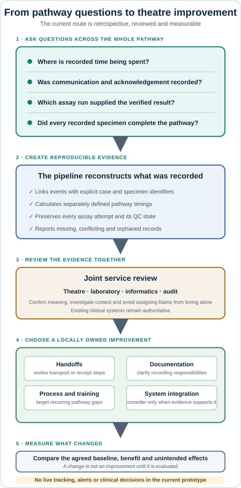

# Product vision

## Product hypothesis

Important OSNA pathway events are produced across theatre, the laboratory, the analyser, result
communication, and the electronic patient record, but they may not form one readily auditable
record. A small integration and evidence layer could make the pathway measurable without
replacing the systems or communication practices that clinicians already rely upon.

This hypothesis remains to be validated with local stakeholders.

## Vision

Create a trustworthy digital thread for each intraoperative OSNA case by linking source events,
preserving their provenance, identifying unsafe ambiguity, and exposing only clearly documented
timings and completeness measures.

## First users and questions

| User | Question the product should help answer |
| --- | --- |
| Theatre and laboratory service leads | Where are handoffs delayed or incompletely recorded? |
| Biomedical scientists | Can a run and verified result be traced to the correct specimen? |
| Breast surgery teams | Is the recorded intraoperative timeline complete? |
| Audit and improvement teams | Can consistent pathway measures be produced without manual reconstruction? |
| Clinical informatics teams | Which events exist, where are they owned, and which gaps require integration? |

The initial product is not a live clinical interface. Its first user is an authorised analyst or
service-improvement team running the pipeline over approved extracts.

## Value to prove

- Fragmented OSNA events can be linked safely enough for pathway audit.
- Missing and contradictory records can be identified without silently repairing them.
- Useful timings can be calculated with clear definitions and source lineage.
- The result reduces manual reconstruction or reveals a genuine coordination gap.

If local discovery shows that existing systems already provide this reliably, the correct outcome
is to stop or narrow the product rather than duplicate them.

## How evidence could reach frontline practice

The current pipeline does not intervene during an operation. Its near-term route to frontline
value is through measured service improvement:

### Evidence-to-improvement detail

| Pathway evidence | Potential effect on theatre work | Pipeline method and limitation |
| --- | --- | --- |
| Specimen dispatch and laboratory receipt times | Identify recurring recorded transport or handoff delays and focus investigation on the affected stage | Link `specimen_sent` and `specimen_received`; a missing record does not prove the physical handoff did not occur |
| Receipt, assay, verification, and communication times | Distinguish where recorded waiting time occurs instead of treating the pathway as one unexplained delay | Calculate separately defined durations; timing alone cannot establish the cause of a delay |
| Communication and theatre acknowledgement records | Show whether the recorded communication loop is complete and whether documentation practice needs review | Preserve verification, communication, and acknowledgement separately; no live acknowledgement function exists |
| Initial, failed-QC, and repeat assay runs | Make complex cases easier to reconstruct without confusing an earlier or failed run with the verified result | Preserve every run and select a result-bearing run only through one explicit laboratory verification |
| Completion across every specimen in a procedure | Reveal records that cannot be safely linked instead of hiding them within an aggregate case view | Use exact identifiers, specimen timelines, procedure summaries, and detailed exceptions; the pipeline does not physically track specimens |
| Reproducible pathway measures | Reduce repeated manual reconstruction and support shared theatre–laboratory audit discussions | Produce documented metrics, quality summaries, lineage, checksums, and a deterministic manifest; service benefit still requires evaluation |

These findings may support changes to transport, recording, staffing, training, or system
integration, but the pipeline cannot determine the cause or prescribe the response. Decisions
must be made with clinical, operational, and source-system context.

Any claim that the product reduces delays, interruptions, lost specimens, or staff workload must
be tested against an agreed baseline. A future live status view or alerting function would be a
new clinical product phase, not an automatic consequence of the retrospective pipeline. See the
[frontline value and human-factors research note](../discovery/frontline-value-and-human-factors-notes.md).

## Longer-term direction

If the evidence supports it, the same event model could accept approved interfaces, provide a thin
readiness or exception view, and export governed audit or registry datasets. Linkage with final
pathology, MDT decisions, treatment, and outcomes is a later phase.

Predictive models, patient-specific recommendations, and genomic sequence processing are outside
the intended purpose of this product and would require separate evidence and assurance.
